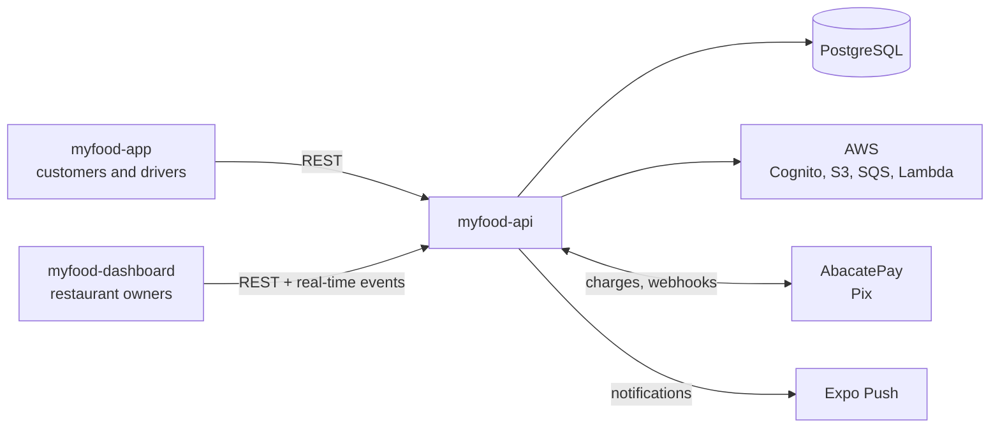
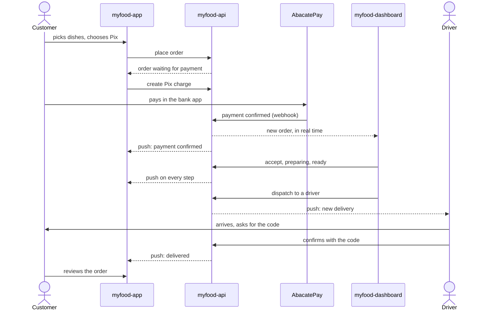

# MyFood

An iFood-style food delivery platform, built end to end: a backend, a web dashboard for
restaurants and a mobile app for customers and drivers.

**[API reference](https://pedrohdionisio.github.io/myfood-api/api/)** ·
**[myfood-api](https://github.com/pedrohdionisio/myfood-api)** ·
**[myfood-dashboard](https://github.com/pedrohdionisio/myfood-dashboard)** ·
**[myfood-app](https://github.com/pedrohdionisio/myfood-app)**

## What it is

MyFood connects three people around one order:

- **The restaurant owner** registers the business, builds the menu, accepts and prepares orders in
  real time, dispatches them to a driver and follows sales day by day — from a web dashboard.
- **The customer** finds the restaurants that deliver to their address, orders, pays with Pix or on
  delivery, and follows the order to their door — from a mobile app.
- **The driver** gets the deliveries assigned to them and closes each one with a four-digit code
  that only the customer has — from the same mobile app, with a separate account.

It is a portfolio project, but it is built the way a production system is: real authentication,
real payments, background processing, automated tests and CI, and documented decisions.

## The repositories

| Repository | What it is | Stack |
|---|---|---|
| [**myfood-api**](https://github.com/pedrohdionisio/myfood-api) | REST API, background workers and AWS Lambdas | Node.js, TypeScript, Fastify, Drizzle, PostgreSQL, AWS, Vitest |
| [**myfood-dashboard**](https://github.com/pedrohdionisio/myfood-dashboard) | Web dashboard for restaurant owners | React, TypeScript, Vite, TanStack Query, Tailwind |
| [**myfood-app**](https://github.com/pedrohdionisio/myfood-app) | Mobile app for customers and drivers | React Native, Expo, TypeScript, TanStack Query, NativeWind |

Each repository has its own README with the architecture, the design decisions and how to run it.

## How it fits together

The API is the only thing that talks to the database, the payment provider and the user pools. The
two frontends talk only to the API, and the contract between them is an OpenAPI spec generated
from the API's code — the [API reference](https://pedrohdionisio.github.io/myfood-api/api/) is
that spec, published.

## The life of an order

Things that happen along the way, and why they matter:

- **Prices are recalculated on the server.** The app sends products and quantities; the API prices
  the order from its own database, checks the opening hours and whether it delivers to that city.
- **A double tap places one order.** Every checkout carries an idempotency key.
- **The restaurant never sees an unpaid order.** A Pix order only reaches the board once the
  payment confirms; if the webhook is lost, a background worker asks the payment provider and
  confirms it anyway, and a payment that arrives after the order was canceled is refunded.
- **The delivery code never leaves the customer.** No restaurant or driver screen, notification or
  log contains it — and the API's test suite checks every route for it.
- **Sales numbers stay exact.** Order events go through a transactional outbox and an SQS queue to
  consumers that ignore duplicates, and the dashboard's charts read from those aggregates.

## Engineering at a glance

- **Clean architecture** in the API — domain, use cases and adapters, with dependencies pointing
  inwards — and a data / presentation / shared split in both frontends.
- **Two isolated user pools** (customers, restaurant staff) on AWS Cognito, with roles checked in
  the database on every request so revoking access takes effect immediately.
- **Real time without WebSockets**: server-sent events for the dashboard, push notifications for the
  app.
- **Pay-per-use infrastructure** only (Cognito, S3, SQS, Lambda), provisioned as code with the
  Serverless Framework.
- **Tests against a real PostgreSQL**, with external services faked, and CI that also fails when a
  migration or the API contract falls out of date.

## Status

The platform runs locally with Docker; it is not deployed yet. The
[API reference](https://pedrohdionisio.github.io/myfood-api/api/) is published and always matches
the code.

To run everything, start with [myfood-api](https://github.com/pedrohdionisio/myfood-api#running-the-full-stack)
(it seeds restaurants, customers, drivers and two months of orders), then the
[dashboard](https://github.com/pedrohdionisio/myfood-dashboard#running-locally) and the
[app](https://github.com/pedrohdionisio/myfood-app#running-locally).

## Author

**Pedro Henrique Dionisio** — [LinkedIn](https://www.linkedin.com/in/pedrohenriquedionisio/)
